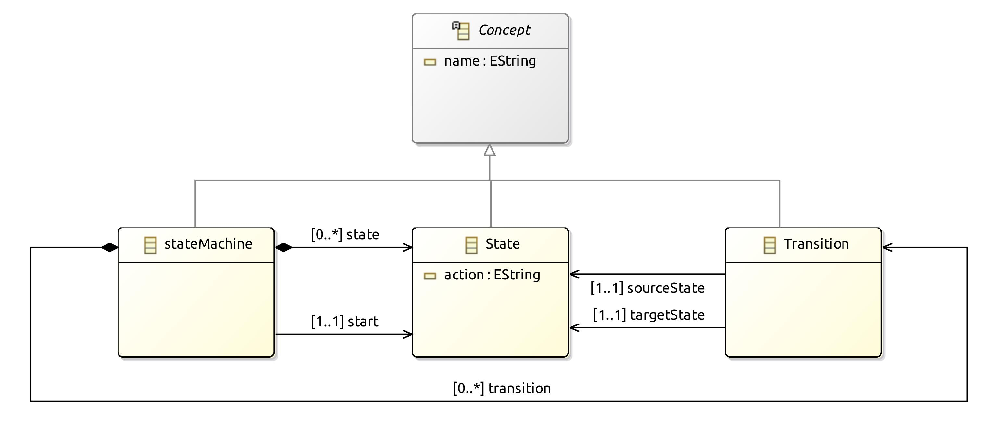
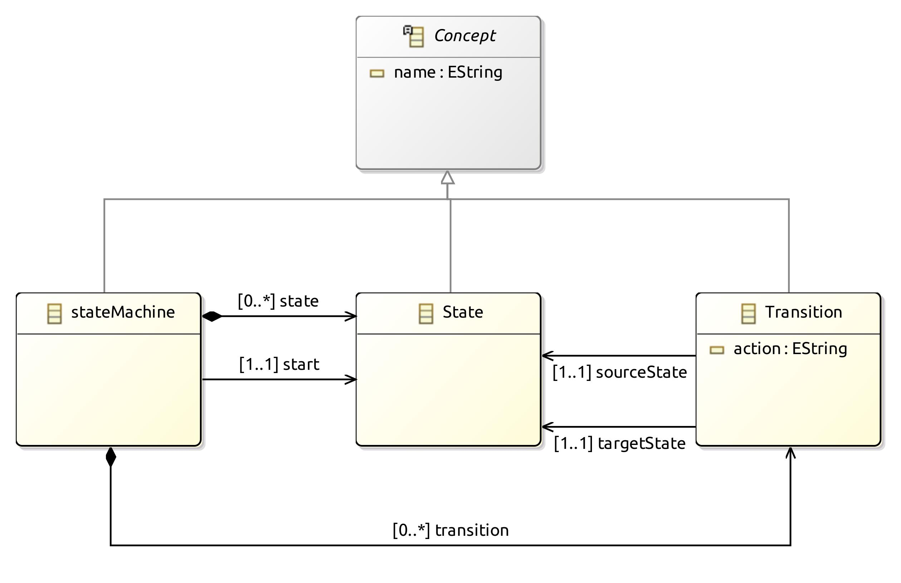

# RAMDE
## Assignment 1 - Moore and Mealy State Machines

## Objectives:
The first objective of this assignment is to create a metamodel for the Moore state machine and a metamodel to the Mealy state
 machine within the Eclipse IDE with the Eclipse Modeling Framework (EMF) package and the OCL SDK installed.

Then, the objective is to create state machine models of both machines and explore model validation and queries with OCL.

## Theoretical Concepts
### Model
A simplified or partial representation of the reality, or an abstraction, defined to accomplish a task or to reach an agreement.

### Metamodel
It can be seen as a model of a model. It's an abstraction of a model: every model has a Metamodel, which can be it-self.

### MDE
Model Driven Engineering (MDE) uses models and metamodels to represent software systems and implement part of it, by generating code from the models created. The models can also be used in the creation of prototypes and in requirements engineering.

### State Machine
A State Machine or a Finite State Machine (FSM) is a model that describes the behavior of the system it represents. This model consists in a finite number of states (one of which is the starting state), inputs and transitions.

For each input received on the machine, it has a corresponding transition from the current state to another state.

There are two basic types of state machines: Moore state machines and Mealy state machines. The two types can always be translated into each other.

### Moore State Machine
A Moore state machine is a state machine that produces outputs only on states.

### Mealy State Machine
A Mealy state machine is a state machine that produces outputs only on transitions.

## Solution Design
### Description
These two designs consist of a Moore state machine and a Mealy state machine, designed in Eclipse IDE using EMF tools, that abstracts a light switch.

The light switch has:

- Three different brightness levels: Dimmed, Meddium and High.
- Two buttons: On and Off.

The button On cycles through the different brightness levels ( Dimmed >> Medium >> High >> Dimmed >> etc.) and turns the light Dimmed when the light is off.

When a button is pressed, an event is raised and the machine changes state and can generate outputs accordingly.

## Solution Implementation
### Metamodel
First, we created a new *Ecore Modeling Project* with a *ddesign* viewpoint in Eclipse IDE for a Moore and a Mealy state machine and we designed one metamoddel for each machine using the graphic tools of the EMF.

Moore Machine Metamodel:

Mealy Machine Metamodel:

## Model
Then we created an instance or moddel of each state machine by creating a .xmi file in each project and adding the following states and trasitions as childs of the instance of each state machine:

- State LightOff
- State LightOnDimmed
- State LightONMedium
- State LightOnHigh
----------------------------------------------------------------------------------
- Transition OnPressed  (Source State: LightOff		| Target State: LightOnDimmed)
- Transition OnPressed  (Source State: LightDimmed	| Target State: LightOnMedium)
- Transition OnPressed  (Source State: LightOnMedium| Target State: LightOnHigh)
- Transition OnPressed  (Source State: LightOnHigh	| Target State: LightOnDimmed)
- Transition OffPressed (Source State: LightOnDimmed| Target State: LightOff)
- Transition OffPressed (Source State: LightOnMedium| Target State: LightOff)
- Transition OffPressed (Source State: LightOnHigh	| Target State: LightOff)

The outputs are generated on the states or transitions depending on the type of the machine.

### Model validation with OCL
Finaly, using OCL, we created constraints for model validation that were tested in the interactive Xtext OCL console in a first stage. After tested, we proceded to add the constraints in the .ecore file of each project, using the OCLinEcore Editor.

The OCL code and description of all the constraints used in bothe projects are the following:

- Checks if the StateMachine has exactly 4 states and 7 transitions:
invariant InvalidLightSwitch: self.state->size() = 4 and self.transition->size() = 7; 

- Checks if every transition of the StateMachine is has a source and a target  of the type 'State':
invariant InvalidStateMachine: self.transition->forAll(t | t.sourceState.oclIsTypeOf(State) and t.targetState.oclIsTypeOf(State)); 

- Checks if the StateMachine has one start state:
invariant InvalidStart: self.state->one(s | s=self.start); 

- Checks if every state of the StateMachine is, at least, a source or a target of any transition:
invariant InvalidState: self.state->forAll(s | self.transition->exists(t | t.sourceState=s or t.targetState=s));

- Checks if every state of the StateMachine is valid and defined (Only for the Moore state machie):
invariant InvalidStateAction: self.state.action <> oclIsInvalid() and self.state.action <> oclIsUndefined();

- Checks if every state of the StateMachine is valid and defined(Only for Mealy state machine):
invariant InvalidTransitionAction: self.transition.action <> oclIsInvalid() and self.transition.action <> oclIsUndefined();

## Further Considerations
- Both Metamodels could be implemented without the class 'Concept', by adding its attribute 'name' as an attribute to each of the classes that extends it.
___

## References
- [Itemis - State Machines](https://www.itemis.com/en/yakindu/state-machine/documentation/user-guide/overview_what_are_state_machines?hsLang=de)
