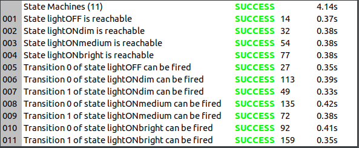

# RAMDE
## Assignment 3 - Report

## Objectives:
The objective of this assignment is to develop and model of a Light Switch Moore and Mealy finite State Machine (described in the next chapter) using the tool MPS with Mbeddr plugin.

Within MPS tool, create tests to verify both state machine and perform robustness analysis with CBMC.

## Theoretical Concepts
### UML
Unified Modeling Language is a general purpose modelling language that can be used to design and visualize diagrams that portrays the behavior and structure of a system in a standard way.

The UML diagrams can be classified as: Structural Diagrams (static aspects or structure of a system) and Behavior Diagrams (dynamic aspects or behavior of the system)

### DSL
Domain Specific Language (DLS) is a programming language with a higher level of abstraction specialized to a particular application or use cases which uses the concepts and rules from the field or domain.

Making it more efficient to design an application and to find and correct errors of logic. Also allows a smoother development of the application since it's possible for non-developers and people who do not know the domain understand the overall design.

Some examples of DSL are: CSS, make and SQL

### State Machines
A state machine is a behavior model that allows to represent the behavior and functionality of an system or application. It's, mainly, composed by: <em>States</em>, <em>Transitions</em>, Actions and <em>Events</em>.

The flow will always start at the initial <em>State</em> and given an <em>Event</em> (trigger or input) the system will <em>Transition</em> to another <em>State</em> and execute an <em>Action</em> according to the system design.

Note that a State Machine must follow some rules:

- Must have an initial State
- The system must be able to enter and leave every defined State
- In a given State a Transition can only enter one state

## Solution Design
### Description
The light Switch system proposed to develop has as main objective to turn off and to turn on, with three different brightness levels, a set of lights using two buttons.
The systems starts with the lights Off and when the user presses the *button ON* the light will turn On with *brightness dimmed*. Then if pressed again the light will increase the brightness to *medium* and finally, if pressed again, increase to *brightness High*.
The user can loop the brightness of this light system by continuing pressing the *button on*.
At any time if the *button Off* is pressed the lights will be turned off.

### State Machine
So, to implement a state machine of this system it is needed to define:

- States
- Transitions
- Events
- Actions

#### 1 - States

Since there is three kinds of brightness and the lights can be turned off, the states will be:

- lightOFF
- lightONdim
- lightONmedium
- Light On Bright

The lightOFF State will be chosen to be the starting point of this state machine.

#### 2 - Transitions
Seeing that the system to be implemented is supposed to be a Finite State Machine every state must be reachable and must have a possible transition to a different state.
So it will be defined a transition for each ON state (lightONdim, lightONmedium, Light On Bright) to the lightOFF state and transitions for each ON state to the next brightness level looping always to the lightONdim state.

#### 3 - Events
As described above, the system has two buttons: ON and OFF. So the events will be directly linked to the button pressed.

- ON Button - ON_pressed event
- OFF Button - OFF_pressed event

#### 4 - Actions
The actions will be defined according to the target state:

- brightnessOff
- brightnessLow
- brightnessMedium
- brightnessHigh
  
As described in the previous chapter, Moore and Mealy FSM differ from each other when it comes to executing the Actions. And so, in Moore FSM the actions will be executed when entering the target state and in Mealy FSM the action will execute during the transition to the target state.

The State Machine was build according to the system design detailed above.
The following table describes all the states, transitions, events and the actions performed.

|   **State**   | **Action inState (Moore)** | **Transition to** | **with Event** | **Action inTransition (Mealy)** |
| :-----------: | :------------------------: | :---------------: | :------------: | :-----------------------------: |
|   lightOFF    |       brightnessOff        |    lightONdim     |   ON_pressed   |          brightnessLow          |
|  lightONdim   |       brightnessLow        |     lightOFF      |  OFF_pressed   |          brightnessOff          |
|               |             -              |   lightONmedium   |   ON_pressed   |        brightnessMedium         |
| lightONmedium |      brightnessMedium      |     lightOFF      |  OFF_pressed   |          brightnessOff          |
|               |             -              |    lightONhigh    |   ON_pressed   |         brightnessHigh          |
|  lightONhigh  |       brightnessHigh       |     lightOFF      |  OFF_pressed   |          brightnessOff          |
|               |             -              |    lightONdim     |   ON_pressed   |          brightnessLow          |

Even though this state machines are simple it is possible to understand that Mealy State machine simplifies the tasks preformed in each state.

## Solution Implementation

To implement the light Switch state machine model in MPS and MBEDDR we started be creating a new project witch starts with one *BuildConfiguration* module and one *Implementation* module.
To build the state machine we made a new *Implementation*, called "StateMachine", in witch is possible to import the necessary libraries, declare events and create states.
Within the states it is also possible to add actions when the state machine enters and/or exits that state, add transitions by a given event and add actions.

### Tests an Analyses
Using the CBMC tool it is possible to run tests trough the developed state machine.
In the *Implementation* created in the new project it was detailed a set of triggers (and state confirmation) that can test if the state machine is feasible: if all the states are reachable and if all transitions can be triggered.
And, by creating an *Analyses* module, we could make analyses to each test and then verify the analyses configuration.

With this test it was possible to realize that without a initial state, the state machine cannot be feasible or runned.
And also that a single trigger can only have a transition to a single state.

## Alternative Implementation(s)
To increase the systems complexity we could add more buttons, so each button is responsible for each brightness level.
Or if this system is responsible for illuminating a big room (like an open office) the lights could be divided by areas and it could be added sensors to detect movement (in each area) and timeouts to turn Off the light in case there is no movement for an amount of time in that area.

This systems could also be modeled in Eclipse and tested with OCM.
___

## References

- [Itemis - State Machines](https://www.itemis.com/en/yakindu/state-machine/documentation/user-guide/overview_what_are_state_machines?hsLang=de)
- [MPS - DSL](https://www.jetbrains.com/mps/concepts/domain-specific-languages/)
- [IBM - UML](https://developer.ibm.com/articles/an-introduction-to-uml/)
