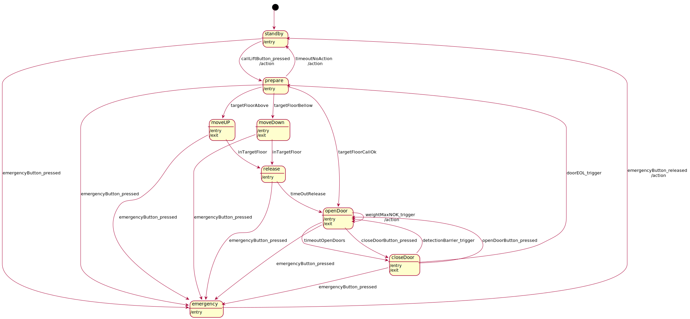
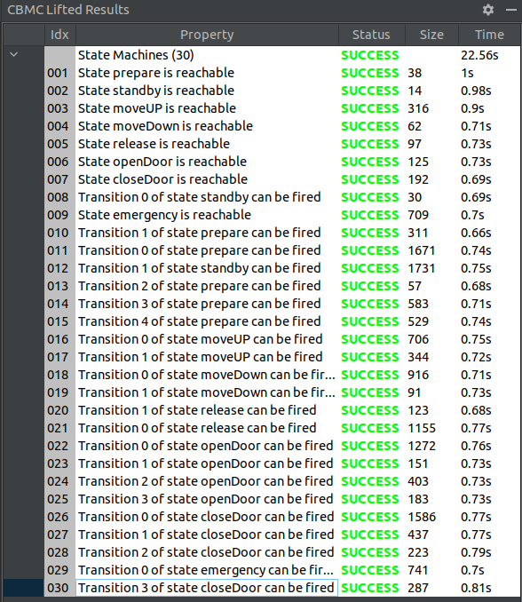
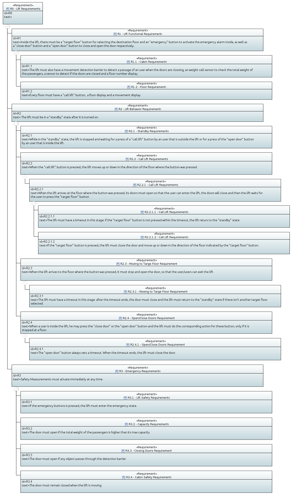
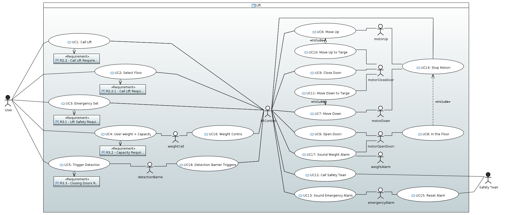
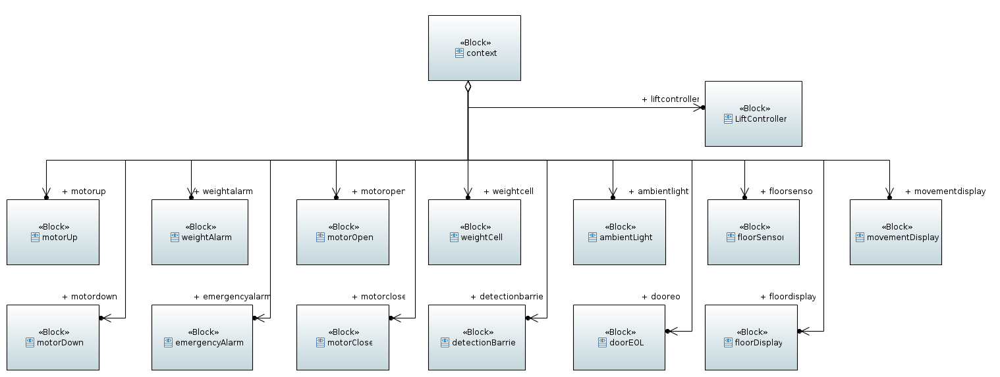
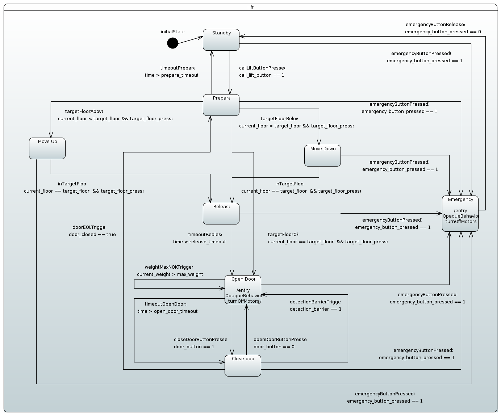
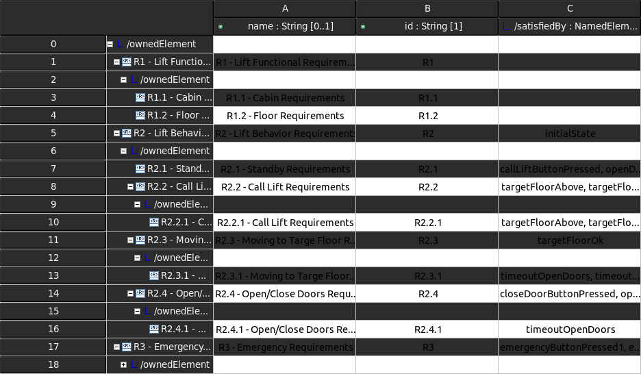

# RAMDE
## Assignment 4 - Lift State Machine

## Objectives:
The objective of this assignment is to design and develop a system witch needs a state machine and then, model the system using the tool MPS with Mbeddr plugin.

Within MPS tool, create tests to verify both state machine and perform robustness analysis with CBMC.

## Theoretical Concepts

### MDA
Model Driven Architecture® (MDA®) is an approach to software design, development and implementation spearheaded by the OMG. MDA provides guidelines for structuring software specifications that are expressed as models. 

MDA separates business and application logic from underlying platform technology. Platform-independent models of an application or integrated system’s business functionality and behavior, built using UML and the other associated OMG modeling standards, can be realized through the MDA on virtually any platform, open or proprietary, including Web Services, .NET, CORBA R, J2EE, and others.

Requires:

- Model-to-model transformation: Plataform Independent Models (PIM) to Plataform Specific Models (PSM) with Query Views and Transformations (QVT) language.
- Model-to-code transformation: PSM-Code.

The use of MDA is behond forward engineering. It also can be used as a metamodel to re-implement applications in other languages.

### UML
Unified Modeling Language is a general purpose modelling language that can be used to design and visualize diagrams that portrays the behavior and structure of a software-based system in a standard way.

The UML diagrams can be classified as: Structural Modeling (static aspects or structure of a system) and Behavior Modeling (dynamic aspects or behavior of the system)

### SysML
Systems Modeling Language (SysML) is a general-purpose system architecture modeling language (General Porpose Language - GPL) for Systems Engineering applications.

SysML supports the specification, analysis, design, verification, and validation of a broad range of systems and systems-of-systems. These systems may include hardware, software, information, processes, personnel, and facilities.

SysML is a dialect of UML 2, and is defined as a UML 2 Profile. (A UML Profile is a UML dialect that customizes the language via three mechanisms: Stereotypes, Tagged Values, and Constraints).

Besides the structural and behavior modeling of UML, SysML adds Package diagrams, Requirement diagrams and Parametric diagrams. It also adds Block Defenition and Internal Block diagrams to Structure Modeling.

SysML is an enabling technology for Model-Based Systems Engineering (MBSE).

### DSL
Domain Specific Language (DSL) is a programming language with a higher level of abstraction specialized to a particular application or use cases which uses the concepts and rules from the field or domain.

Making it more efficient to design an application and to find and correct errors of logic. Also allows a smoother development of the application since it's possible for non-developers and people who do not know the domain understand the overall design.

This is an alternative to MDA.

Some examples of DSL are: CSS, make and SQL

### State Machines
A state machine is a behavior model that allows to represent the behavior and functionality of an system or application. It's, mainly, composed by: <em>States</em>, <em>Transitions</em>, Actions and <em>Events</em>.

The flow will always start at the initial <em>State</em> and given an <em>Event</em> (trigger or input) the system will <em>Transition</em> to another <em>State</em> and execute an <em>Action</em> according to the system design.

Note that a State Machine must follow some rules:

- Must have an initial State
- The system must be able to enter and leave every defined State
- In a given State a Transition can only enter one state

## Solution Design
### Description
The system designed is a Lift system from a building with the goal of transporting people and cargo between floors.

This Lift system was design to be easy to use: The user will press the *callLift button* and the lift will move (up or down according to the lifts current floor) to the floor where the call was made and then open its doors. 
Then, the user can choose is destination floor (*targetFloor buttons*). If the user also pressed the *closeDoor button* the lift will close its doors and move to its destination floor (if *closeDoor button* is not pressed a timeout will trigger the closing of doors).
When the lift arrives at destination floor the doors will open (after a timeout) and if there isn't another call or another destination the lift will go in standby (after closing the doors).
To assure the user safety, this lift as a *emergency button* that when is pressed it will call the security team, sound a emergency alarm and shutdown every motor. It also has a *weight cell* sensor that can measure the total weight inside the lift to avoid high loads and a detection barrier to detect objects when the doors are closing.

This system is composed by:

- Actuators

      - **motorUP** - Responsible for moving the Lift upwards;
      - **motorDown** - Responsible for moving the Lift downwards;
      - **motorOpen** - Responsible for Opening the doors;
      - **motorClose** - Responsible for Closing the doors;
      - **ambientLight** - Responsible for Illuminating the inside of the lift;
      - **weightAlarm** - Responsible for emitting an alarm;
      - **emergencyAlarm** - Responsible for emitting an alarm;
      - **floorDisplay** - Responsible for showing the current floor. Situated inside and outside the lift cabin;
      - **movementDisplay** - Responsible for showing the current movement of the lift(up or down). Situated outside the lift cabin;
  
- Sensors

      - **doorEOL** - Responsible for detecting if the door is closed;
      - **detectionBarrier** - Responsible for detecting any movement ;between the doors when tey are closing;
      - **weightCell** - Responsible for measuring the total wight inside the lift;
      - **floorSensor** - Responsible for detecting the floors so the lift can know in which floor is;
  
- Buttons

      - **callLift** - Responsible for calling the Lift. Situated outside the lift cabin, in each floor;
      - **targetFloor** - Responsible for selecting the floor which the lift must go. Situated inside the lift cabin;
      - **emergency** - Responsible for setting an emergency state. Situated inside the lift cabin;
      - **openDoor** - Responsible for opening the doors. Situated inside the lift cabin;
      - **closeDoor** - Responsible for closing the doors. Situated inside the lift cabin.

### State Machine
The State Machine was build according to the system design detailed above.
The following table describes all the states, transitions, events and the actions performed during the transitions.

| **State** | **Transition to** |      **With Event**      |                           **Action inTransition**                           |
| :-------: | :---------------: | :----------------------: | :-------------------------------------------------------------------------: |
|  standby  |      prepare      |  callLiftButton_pressed  |                            Turn On ambient light                            |
|           |     emergency     | emergencyButton_pressed  |                           Turn On emergency alarm                           |
|  prepare  |      moveUP       |     targetFloorAbove     |                                      -                                      |
|           |     moveDown      |    targetFloorBellow     |                                      -                                      |
|           |     openDoor      |      targetFloorOK       |                                      -                                      |
|           |      standby      |     timeoutNoAction      |                           Turn Off ambient light                            |
|           |     emergency     | emergencyButton_pressed  |                           Turn On emergency alarm                           |
|  moveUp   |      release      |      inTargetFloor       |                                      -                                      |
|           |     emergency     | emergencyButton_pressed  |                           Turn On emergency alarm                           |
| moveDown  |      release      |      inTargetFloor       |                                      -                                      |
|           |     emergency     | emergencyButton_pressed  |                           Turn On emergency alarm                           |
|  release  |     openDoor      |      timeOutRelease      |                                      -                                      |
|           |     emergency     | emergencyButton_pressed  |                           Turn On emergency alarm                           |
| openDoor  |     openDoor      |   weightMaxNOK_trigger   |                             Turn On weightAlarm                             |
|           |     closeDoor     |     timeoutOpenDoors     |                                      -                                      |
|           |     closeDoor     | closeDoorButton_pressed  |                                      -                                      |
|           |     emergency     | emergencyButton_pressed  |                           Turn On emergency alarm                           |
| closeDoor |     openDoor      | detectionBarrier_trigger |                                      -                                      |
|           |     openDoor      |  openDoorButton_pressed  |                                      -                                      |
|           |      prepare      |     doorEOL_trigger      |                                      -                                      |
|           |     emergency     | emergencyButton_pressed  |                           Turn On emergency alarm                           |
| emergency |      standby      | emergencyButton_released | Turn Off ambient light, Turn Off emergency alarm, Turn Off call security team |

## Solution Implementation - DSL (MPS and Mbedder)

To implement the proposed solution in MPS and MBEDDR we started be creating a new project witch starts with one *BuildConfiguration* module and one *Implementation* module.
To build the state machine we made a new *Implementation*, called "StateMachine", in witch is possible to import the necessary libraries, declare events and create states.
Within the states it is also possible to add actions when the state machine enters and/or exits that state, add transitions by a given event and add actions to transitions.
The next image is the result of the developed state machine.

### Tests an Analyses
Using the CBMC tool it is possible to run tests trough the developed state machine.
In the *Implementation* created in the new project it was made a set of tests cases that can test if the state machine is feasible, if all the states are reachable and if all transitions can be triggered.
And, by creating an *Analyses* module, we could make analyses to each test and then verify the analyses configuration.

The set of tests cases are:

- **testMain** - In this test all the scenarios (described below) are tested;
- **testEmergencyMovingUp** - This test will simulate an user pressing the *emergencyButton* while the lift is moving upwards;
- **testEmergencyMovingDown** - This test will simulate an user pressing the *emergencyButton* while the lift is moving downwards;
- **testEmergencyRelease** - This test will simulate an user pressing the *emergencyButton* while the lift arrives at the destination floor ;
- **testEmergencyOpenDoors** - This test will simulate an user pressing the *emergencyButton* while the lift is opening the doors;
- **testEmergencyCloseDoors** - This test will simulate an user pressing the *emergencyButton* while the lift is closing the doors;
- **testEmergencyPrepare** - This test will simulate an user pressing the *emergencyButton* while the lift is checking the destination floor;
- **testEmergencyStanBy** - This test will simulate the trigger of *emergencyButton* while the lift in standby;
- **testWeightError** - This test will simulate the weightMaxNOK trigger when the load inside the lift is bigger than the normal;
- **testClosingDoor** - This test will simulate the user pressing *openDoorButton* while the doors are closing and simulate the user passing trough the detection barrier while the doors are also closing;
- **testMovingUP** - In this test calls the lift from a floor bellow and then chooses a floor above;
- **testMovingDOWN** - In this test calls the lift from a floor above and then chooses a floor bellow.

## Solution Implementation - GPL (Eclipse, Papyrus and SysML)
In Eclipse and Papyrus, we started by creating a new Papyrus project and select SysML 1.6 for the architecture context.

In the created Papyrus project, we created a new Requirement Diagram. We first create a list of requirements and then we grouped them into three main types of requirements (Functional requirements, behavior requirements and Emergency requirements) and defined "comtainment" relationships within each group. This way we were able to identify the requirements that needed more detail and explore them a bit more.

After we createdd a the package "requirements", we proceded to creadte and design the diagram in the created package, using the graphical tools provided by Papyrus and SysML.

A "root" requirement that contains all others was also created for a better handling of all the requirements.

Requirement diagram:

The design of a new Use Case diagram was also completed with only the graphical tools provided by Papyrus and SysML and was stored in the package "usecases".

For each of the 5 use cases that interact directly with the user, we created a dependency of a matching requirement.

Use Case diagram:

As the previous diagrams, a very simple Block Definition diagram was also designed. There were no composition relationships between the blocks, so it was very straight forward to link all the blocks to the "context" - the root block - as shared associations. The blocks createdd in this step were all stored in a new package "context", except the block "liftController", which was stored in its own package "lift", because this is the package were the solution would be stored if it was implementated.

Block Definition diagram:

A new package for the State Machine diagram and its components was created with the name "statemachine". we created the state machine diagram within this package and designed it graphically.
We created and defined "Change Events" which were set as events for the triggers of every transition of the diagram.
Finally, we added entry actions for specific states of the machine.

State Machine diagram:

The model was validated by the UML an SysML metamodels.

After linking the components of the state machine (states and transitions) to the each of the requirements by creating "Satisfy" relationships between them, we created a new generic tree table from the root requirement. We then rearranged the columns of the table to only show the so that it only shows the name andd ID of the requirements and the component of the state machine that satisfies each requirement.

Crosscutting Requirements Table:

## DSL (MPS and Mbedder) vs GPL (Eclipse, Papyrus and SysML)
Eclipse and Papyrus offer a more graphical framework to develop models than the MPS with Mbeddr.
Dispite that, being able to generate code and the flexibility of the DSLs gives a big advantage to MPS and Mbeddr.
Both tools seem very complete, but it wasn't possible to study Papyrus as much as MPS in the scoop of this project.
That being said, the main goal of MPS and Mbeddr is to create and manipulate DSLs, while Papyrus works with UML and SysML which are GPLs. So both tools have their utility in MDE.

## Further Considerations
While implementing this state machine we had to consider that after modeling this state machine in MPS a further development must be made to add:

- Condition statements to receive the target state and compare it with the current state. So, this condition will check:
      - if current state is bellow target state -> the lift must go up (*targetFloorAbove*);
      - if current state is above target state -> the lift must go down (*targetFloorBellow*);
      - if current state is equal to target state -> the lift can open the doors (*targetFloorOK*);
- A process to read the floorSensor output and show the current floor on *floorDisplay*. This can be accomplished by adding two inductive sensors (one at the top and one at the bottom of the lift) and by adding two metal points (one at the top and one at the bottom of each floor). The process will be able to determine the lift location while it's moving by counting the floorSensor triggers;
- Velocity ramps (ramp up and ramp down) to motorUp and motorDown so the acceleration and deceleration is smother

### Eclipse, Papyrus and SysML
Dispite of having all the tools to design the Use Case and the Requirement diagrams, this project in Papyrus needed to contain a more elaborate Block Definition diagram and a Block Internal diagram. This would allow us to build a more functional and complete solution.
The most affected diagram was the state machine:

 - All the values of the "Change Events" created where defined as Strings, because there were no variables, nor units to link with the Internal Block diagram.
 - The same goes to the entry actions in the states.
Both of the topics above are shallow and don't have any use but to show what is possible to add to this project in the future.
Other possible implementations to improve this project:

 - OCL validation.
 - Constrains.
 - Code generation.
___

## References
- [Itemis - State Machines](https://www.itemis.com/en/yakindu/state-machine/documentation/user-guide/overview_what_are_state_machines?hsLang=de)
- [MPS - DSL](https://www.jetbrains.com/mps/concepts/domain-specific-languages/)
- [IBM - UML](https://developer.ibm.com/articles/an-introduction-to-uml/)
- [SysML.org - SysML](https://sysml.org/)
- [OMG - MDA](https://www.omg.org/mda/)
- [Youtube - Specification of Embedded Systems](https://www.youtube.com/@specificationofembeddedsys6382/videos)
