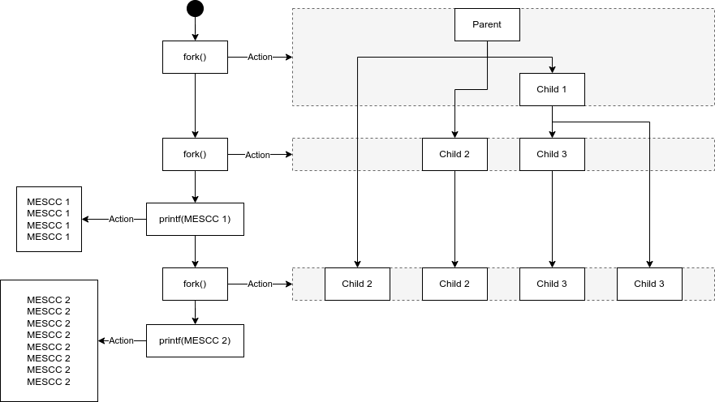

# PL1 Class  

## Exercise 1
### a)
The code output:
```
Step 2. x = -2
Step 3. 53717; x = -2
Step 1. x = 2
Step 3. 0; x = 2
```
In the output example above, the child process ran first (`else` branch of `if` statement) and then the parent process (`if` branch of `if` statement).
There are four prints displayed because each process will have its own `printf()`, inside the `if` statement, and an extra one, outside the `if` statement, which displays the process ID (PID) and the value of `x`.

Since there isn't implemented a shared memory mechanism, `x` will be equal according to the value set in the process
 - x = 2 -> Child Process
 - x = -2 -> Parent process

### b)
The output of the code depends on the order of execution of the parent and child processes after the `fork()` call.

Since they run independently of each other, the first `printf()` could either be:
 - Step 1. x = 2 - If child process runs first (executing the `else` branch of `if` statement first)
 - Step 2. x = -2 - If parent process runs first (executing the `if` branch of `if` statement first)
    
The second `printf()` displays the process ID being:
 - 0 - Child PID
 - 53717 (in this example) - Parent PID

---
## Exercise 2
### a)
The code output:
```
MESCC 1
MESCC 1
MESCC 1
MESCC 1
MESCC 2
MESCC 2
MESCC 2
MESCC 2
MESCC 2
MESCC 2
MESCC 2
MESCC 2
```
This code will create 8 processes.

Knowing that when the `fork()` function is called, a new process is created by duplicating the calling process,

- Begin of code
  - Total process = 1
- The first `fork()` call creates one child process.
  - Total process = 2
    - Parent
    - Child 1
- Both the parent and child processes continue executing the code reaching the second `fork()` call, so each process will create another child process.
  - Total process = 4
    - Parent
    - Child 1
    - Child 2
    - Child 3
- All four processes continue executing the code. Each one will execute the first `printf()` call. Which makes the code display "MESC 1" four times.
  - Total process = 4
- Then each of the four processes reaches the third `fork()` call, so each process will create another child process.
  - Total process = 8
    - Parent
    - Child 1
    - Child 2
    - Child 3
    - Child 4
    - Child 5
    - Child 6
    - Child 7
- All eight processes continue executing the code. Each one will execute the second `printf()` call. Which makes the code display "MESC 2" eight times.
  - Total process = 8

### b)

### c)
As demonstrated in the output example, MESCC is printed twelve times.
- The first four are printed by the first four processes
- The last eight are printed by the eight processes
---
## Exercise 3
### a)
The code output:
```
a=5, b=71971, c=71970, d=46571
a=5, b=0, c=71971, d=71970
```
The output represents:

- `a`: Starts as 0 and it is incremented by 5 regardless of the process (parent or child).
- `b`: is set to the return value of `fork()`, so it will be:
  - 0 - PID of the child process
  - 71971 (in this example) - PID of the parent process
- `c`: is set to the return value of `getpid()`, which returns the PID of the current process.
- `d`: is set to the return value of `getppid()`, which returns the PID of the parent process.

### b)
Yes there are relationships between the values displayed by both parent and child processes:
- `a` wil always be the same in both the parent and child processes
- In the child process the PID of his process (`c`) will be the same as the PID of the parent process (`b`).
- And his parents PID of current process (`d`) will be the same as the parents current process PID (`c`).
---
## Exercise 4
### a)
The code output:
```
End of execution!
End of execution!
End of execution!
End of execution!
End of execution!
End of execution!
End of execution!
End of execution!
End of execution!
End of execution!
End of execution!
End of execution!
End of execution!
End of execution!
End of execution!
```
As the output example shows, the code creates 15 processes:
-   In the first iteration of the `for loop`, one process is created by `fork()`
    - Total process = 2
-   In the second iteration of the `for` loop, two processes are created by `fork()`
    - Total process = 4
-   In the third iteration of the `for` loop, four processes are created by `fork()`
    - Total process = 8
-   In the fourth iteration of the `for` loop, eight processes are created by `fork()`
    - Total process = 15

Note that supposedly the total number of process created should be 16, but since the maximum number of child processes that can be created has already been reached, no new child processes are created in the last iteration making the total of 15.

### b)
The code output:
```
[child] pid 108812
[child] pid 108813
[Parent] pid 46571
[child] pid 108814
[child] pid 108815
```
With `exit()` we can control ne number of child processes that are created in `for loop`.

### C)
The code output:
```
[child] pid 192197
[child] pid 192198
[child] pid 192199
[child] pid 192200
Child process with odd PID 192197 has terminated
Child process with odd PID 192199 has terminated
[Parent] pid 46571

```
With `wait()` function it is possible to get the PID of terminated processes. Then we can check if they are odd and print a message indicating the termination.

### d)
The code output:
```
[child] pid 193128, order 1
[child] pid 193129, order 2
[child] pid 193130, order 3
Child process with order 1 and PID 193128 has terminated
Child process with order 2 and PID 193129 has terminated
[child] pid 193131, order 4
Child process with order 3 and PID 193130 has terminated
Child process with order 4 and PID 193131 has terminated
[Parent] pid 46571
```

We start by defining a struct (`child_pid`) that contains the PID and creation order of a child process.

When we `fork` a child process, we assign its PID and creation order to the corresponding element in the `child_processes` array and use it as the exit status when the child process terminates using the `exit()` function.

Using `WEXITSTATUS()`, we can get the exit status of each child process while the parent process waits for all child processes to terminates since `WEXITSTATUS()` macro extracts the exit status from the status code returned by `wait()`.

Then it is possible to search for the corresponding child process in the `child_processes` array using its PID and display its PID and creation order.
---
## Exercise 5
### C)
Using multiple processes as the advantage of reducing the computation time, since each child process can work on a separate part of the array simultaneously allowing better utilization of resources. While using a single process approach will require the program to iterate through the entire array on it own.

But with multiple processes approaches it could lead to:
- Increase the complexity due to the need of inter-process communication or synchronization
- Increase memory usage (each process will need to store its own copy of the array)

Therefore, the trade-off between using a single or multiple processes would depend on factors such as:
- Size of the array
- Available resources

For example if the array is small a single process approach could be more advantageous due to its simplicity.
---
