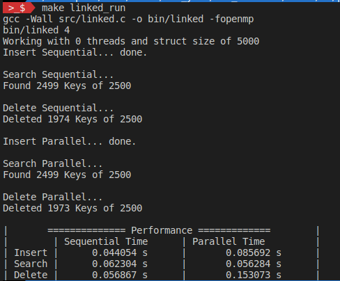

# MESCC - APROP
Group:
- Carlos Rijo    - 1101626
-   - CPU -> 11th Gen Intel® Core™ i7-1185G7
    - Cores -> 8
    - Threads -> 8
    - Clock -> 3.0 GHz
    - Hyperthreading -> No
  - OS -> Ubuntu 22.04.3 LTS
- João Fernandes - 1221973
  - CPU -> AMD® Ryzen 5 5500u
    - Cores -> 6
    - Threads -> 12
    - Clock -> Base Clock: 2.1 GHz, Max Boost Clock: 4.0 GHz
    - Hyperthreading ->Yes (It supports simultaneous multi-threading, providing 2 threads per core)
  - OS -> Ubuntu 22.04.3 LTS


## Exercises for PL 2 - Parallel Programming with OpenMP
To build and run the exercises follow the instructions on [README file](README.md).

### 1 - Matrix multiplication
With matrix sizes of 128
```
gcc -Wall src/mmult.c -o bin/mmult -fopenmp 
bin/mmult 4
Working with 4 threads to multiply two matrices: A{128,128} * B{128,128} = C{128,128}
Thread working on lines... done.
Thread working on region (block)... done.
Thread working with for loop... done.

- ==== Performance ==== -
Sequential time:     0.005236s
Parallel lines time: 0.002574s
Parallel block time: 0.001333s
For loop time: 0.001502s
```
With matrix sizes of 1024
```
gcc -Wall src/mmult.c -o bin/mmult -fopenmp 
bin/mmult 4
Working with 4 threads to multiply two matrices: A{1024,1024} * B{1024,1024} = C{1024,1024}
Thread working on lines... done.
Thread working on region (block)... done.
Thread working with for loop... done.

- ==== Performance ==== -
Sequential time:     13.461640s
Parallel lines time: 4.212118s
Parallel block time: 3.617002s
For loop time: 3.986247s
                            
```
With matrix sizes of 2048
```
Working with 4 threads to multiply two matrices: A{2048,2048} * B{2048,2048} = C{2048,2048}
Thread working on lines... done.
Thread working on region (block)... done.
Thread working with for loop... done.

- ==== Performance ==== -
Sequential time:     204.729744s
Parallel lines time: 95.939057s
Parallel block time: 87.123111s
For loop time: 92.184746s
```
#### Result Comparison


Parallelization using OpenMP is effective in reducing the execution time of matrix multiplication tasks, especially for larger matrix sizes.
The choice of parallelization strategy matters. For this specific case, the "For Loop" approach consistently performs better than the other strategies.
As matrix sizes increase, the speedup achieved by parallelization becomes more significant, making it a valuable technique for handling computationally intensive tasks in scientific computing and data analysis.

### 2 - Area of Mandelbrot Set

With 200 Npoints and 100 MAXITER
```
gcc -Wall src/mandelbrot.c -o bin/mandel -fopenmp -lm 
bin/mandel 4
Sequential Mandelbrot... done.
[SEQ] Area of Mandelbrot set =   1.55503125 +/-   0.00777516 (outside: 28942)

Parallel Mandelbrot... done.
[PAR] Area of Mandelbrot set =   1.55503125 +/-   0.00777516 (outside: 28942)

Parallel Mandelbrot FOR... done.
[PAR FOR] Area of Mandelbrot set =   1.55503125 +/-   0.00777516 (outside: 28942)

- ==== Performance ==== -
Sequential time: 0.009674s
Parallel   time: 0.005393s
Parallel FOR time: 0.004190s
```

With 2000 Npoints and 1000 MAXITER
```
└─$ make mandel_run     
gcc -Wall src/mandelbrot.c -o bin/mandel -fopenmp -lm 
bin/mandel 4
Sequential Mandelbrot... done.
[SEQ] Area of Mandelbrot set =   1.51115766 +/-   0.00075558 (outside: 2925399)

Parallel Mandelbrot... done.
[PAR] Area of Mandelbrot set =   1.51115766 +/-   0.00075558 (outside: 2925399)

Parallel Mandelbrot FOR... done.
[PAR FOR] Area of Mandelbrot set =   1.51115766 +/-   0.00075558 (outside: 2925399)

- ==== Performance ==== -
Sequential time: 7.979261s
Parallel   time: 3.631139s
Parallel FOR time: 3.657849s
```
#### Performance Comparison

  **:Speedup:** Speedup is a measure of how much faster the parallel version is compared to the sequential version. It is calculated as Speedup = Sequential time / Parallel time.

      For the first case (200 Npoints and 100 MAXITER), the speedup is approximately 0.009674 / 0.005393 ≈ 1.79. This indicates that the **parallel version is roughly 1.79 times faster than the sequential version**.

      For the second case (2000 Npoints and 1000 MAXITER), the speedup is approximately 7.979261 / 3.631139 ≈ 2.20. This indicates that the **parallel version is roughly 2.20 times faster than the sequential version**.

  **Efficiency:** Efficiency is a measure of how well the available parallel resources (in this case, threads) are utilized. It is calculated as **Efficiency = Speedup / Number of Threads**.

      In both cases, you mentioned running the program with 4 threads (bin/mandel 4), so the efficiency for both cases can be calculated as follows:
          For the first case: Efficiency = 1.79 / 4 ≈ 0.45
          For the second case: Efficiency = 2.20 / 4 ≈ 0.55

  The efficiency values indicate that the parallelization achieves less than ideal utilization of the available threads. This may be due to overhead associated with thread creation and synchronization.

  **Analysis:**

      The performance gains from parallelization are evident in both cases. Parallel execution significantly reduces the computation time, leading to faster results.

      The speedup is more pronounced in the second case (2000 Npoints and 1000 MAXITER) due to the larger computational workload. This demonstrates that parallelization is especially beneficial when dealing with complex and time-consuming tasks.

      However, the efficiency of parallelization is not very high in either case. This suggests that there may be room for optimizing the parallel implementation to reduce overhead and achieve better utilization of available threads.

      Despite the lower efficiency, parallelization provides a substantial overall performance improvement, making it a valuable technique for accelerating computationally intensive tasks like Mandelbrot set generation.

### 3 - Parallel loops 

For the sake of simplicity and compararison this exercise was made inside the respective challenges above.

### 4 - Quick Sort


```
└─$ make quicksort_run  
gcc -Wall src/quick_sort.c -o bin/quicksort -fopenmp 
bin/quicksort 4
Working with 4 threads to sort an array of size 500000

Sequential Sorting... done!
Parallel Sorting... done!
Parallel and Sequencial Sorting... done!

- ==== Performance ==== -
Sequential time: 0.073384s
Parallel time: 0.230701s
Parallel time (with limit 500): 0.064474s
```


```
└─$ make quicksort_run
gcc -Wall src/quick_sort.c -o bin/quicksort -fopenmp 
bin/quicksort 4
Working with 4 threads to sort an array of size 50000000

Sequential Sorting... done!
Parallel Sorting... done!
Parallel and Sequencial Sorting... done!

- ==== Performance ==== -
Sequential time: 9.998505s
Parallel time: 21.097568s
Parallel time (with limit 50000): 7.643885s
```
#### Results Comparison

Short Array (500,000 elements):

    In the case of the short array, the sequential sorting is significantly faster than the parallel sorting. The parallel implementation takes longer, due to the overhead associated with parallelization.

    Parallel sorting with a limit of 500 ( meaning a limit on the number of elements processed in parallel) is faster than the fully parallel implementation. This indicates that the parallelization is more effective when the parallelism is limited.

Long Array (50,000,000 elements):

    For the long array, the sequential sorting is faster than the parallel sorting. The overhead of parallelization becomes more pronounced with a larger array.

    Parallel sorting with a limit of 50,000 elements per batch is faster than the fully parallel implementation. Similar to the short array, this suggests that limiting the parallelism can lead to better performance for larger datasets.

Conclusion:

  The performance results indicate that the sequential quicksort outperforms the parallel quicksort for both the short and long arrays.

  However, limiting the parallelism by setting a threshold for the number of elements processed in parallel (500 for the short array and 50,000 for the long array) can lead to improved parallel performance, especially for larger datasets.

  The choice between sequential and parallel quicksort depends on the dataset size and the specific implementation details. For smaller datasets, sequential sorting may suffice, while for larger datasets, experimenting with parallelization and adjusting parameters like the batch size can potentially yield better results.

### 5 - Bubble Sort


### 6 - Linked List

#### Result from Carlos Rijo's PC


#### Results from João Fernandes PC
```
gcc -Wall src/linked.c -o bin/linked -fopenmp 
bin/linked 4
Working with 0 threads and struct size of 50000
Insert Sequential... done.

Search Sequential...
Found 24999 Keys of 25000

Delete Sequential...
Deleted 19573 Keys of 25000

Insert Parallel... done.

Search Parallel...
Found 24994 Keys of 25000

Delete Parallel...
Deleted 19563 Keys of 25000

|       ============== Performance =============        |
|        | Sequential Time      | Parallel Time         |
| Insert |      31.871488 s     |       126.912069 s    |
| Search |      23.424702 s     |       22.968024 s     |
| Delete |      31.890144 s     |       130.663805 s    |
```
Then i ran it again and i got the following results
```
|       ============== Performance =============        |
|        | Sequential Time      | Parallel Time         |
| Insert |      24.875780 s     |       125.501828 s    |
| Search |      21.797890 s     |       23.726125 s     |
| Delete |      28.306528 s     |       139.966156 s    |
```
Then i ran it a third time getting the following values:
```
|       ============== Performance =============        |
|        | Sequential Time      | Parallel Time         |
| Insert |      28.650160 s     |       125.241755 s    |
| Search |      20.604314 s     |       24.879840 s     |
| Delete |      29.753922 s     |       141.494793 s    |
```
#### Result Comparison

The bar chart above shows the average execution times for sequential and parallel operations across three runs for Insert, Search, and Delete. The orange bars indicate the average sequential times, and the blue bars represent the average parallel times. Here's the summary of the average times:

    Insert: The average sequential time is significantly lower than the average parallel time.
    Search: The average times are quite close, with the sequential being slightly faster on average.
    Delete: Similar to the Insert, the average sequential time is much lower than the average parallel time.

It's interesting to note that the parallel execution times are considerably higher than the sequential ones for Insert and Delete operations. This could be due to overheads associated with parallel processing or the nature of the operations which may not benefit from parallelism in this particular scenario. The Search operation, however, shows that parallel processing can offer comparable performance to sequential processing, potentially benefiting from parallelism given the right conditions


The performance comparison chart above shows the percentage difference in execution time between parallel and sequential operations. Here's the analysis:

    Insert: Parallel execution is 342.23% slower than sequential.
    Search: Parallel execution is 8.73% slower than sequential.
    Delete: Parallel execution is 358.17% slower than sequential.

The chart illustrates that parallel execution is significantly slower for both Insert and Delete operations compared to sequential execution which makes sense. For the Search operation, the parallel execution is slightly slower. These results suggest that the parallelization overhead for Insert and Delete operations are not compensated by the parallel execution speedup, while for Search, as the linked list sizes increases the exection time will start to decrease in comparison with the sequentia version.

The performance results suggest that parallelization using OpenMP may not be advantageous for insert and delete operations on a linked list in this specific scenario. The overhead associated with parallel processing outweigh any potential speedup since using the MUTEX will block and we will run sequential code in a parallelized way. This means that we will run the code sequential but with the overhead of parallelization.

This means that we will only run the search operation faster since the mutexes are not present since we dont have a write/delete operation but a read.